# Side Jobs is a REACT web application used to connect people who need to make money with people who want to save time. The goal of the app was to make a safe user to user platform, that offered many different options for side gigs for making extra cash outside of the 9 to 5 work style.

A simple design was implemented to put back focus on the functionality of the app. Material-UI was the main styling framework for the application to keep universal consistency.

|                  *Homepage*       |
|:-----------------------:|
| 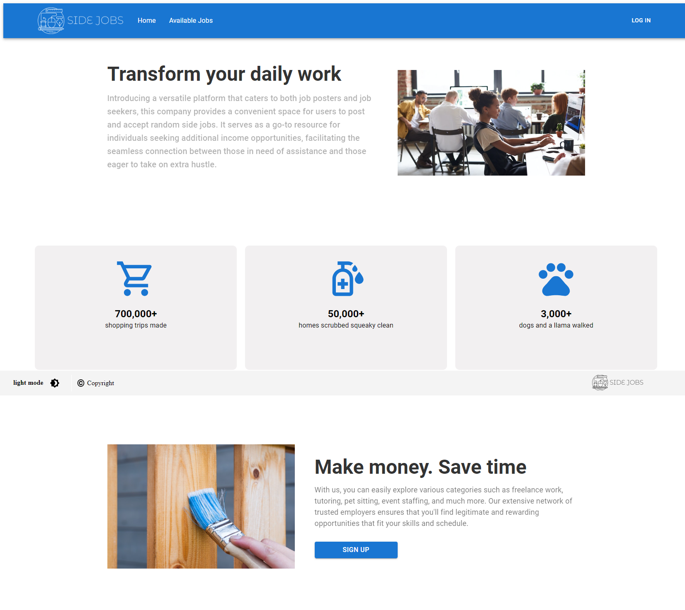 |

Once logged into the website, users are able to navigate through their activity and create postings for jobs. Error handling was tested extentsively to prevent users from sending POST requests for the backend API and ultimately adding wrong data into the PostgreSQL database. The form for the POST request uses google Places API to autofill the correct location for the job listing.

|           *Drop-Down*              |                  *Post Jobs*       |
|:-----------------------:|:-----------------------:|
| 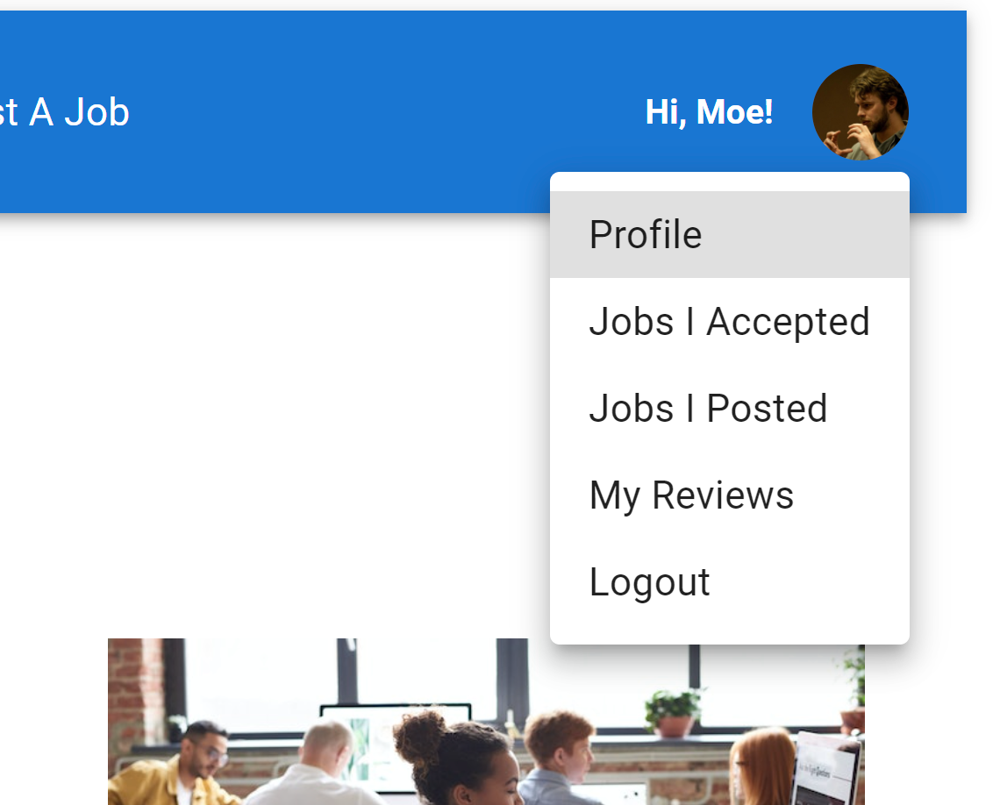 | 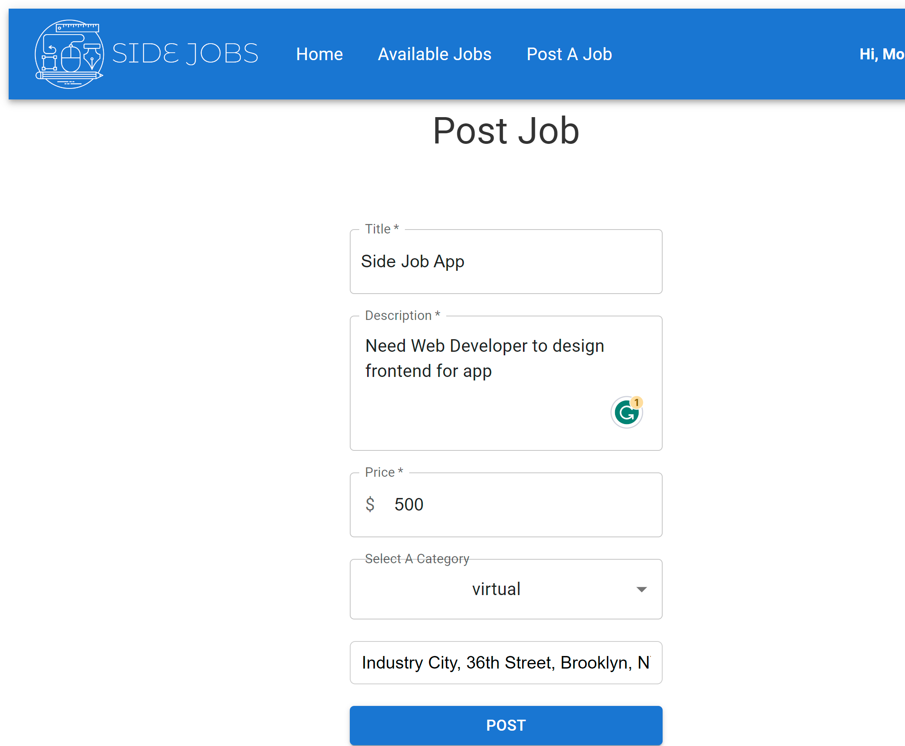 |

In the users account, they could see their active tasks and see what new task they could add to their schedule. The users experience was the main focal point for the layout, so each page has its own REACT component.

|                  *Accepted Jobs*       |           *Available Jobs*              |
|:-----------------------:|:-----------------------:|
| 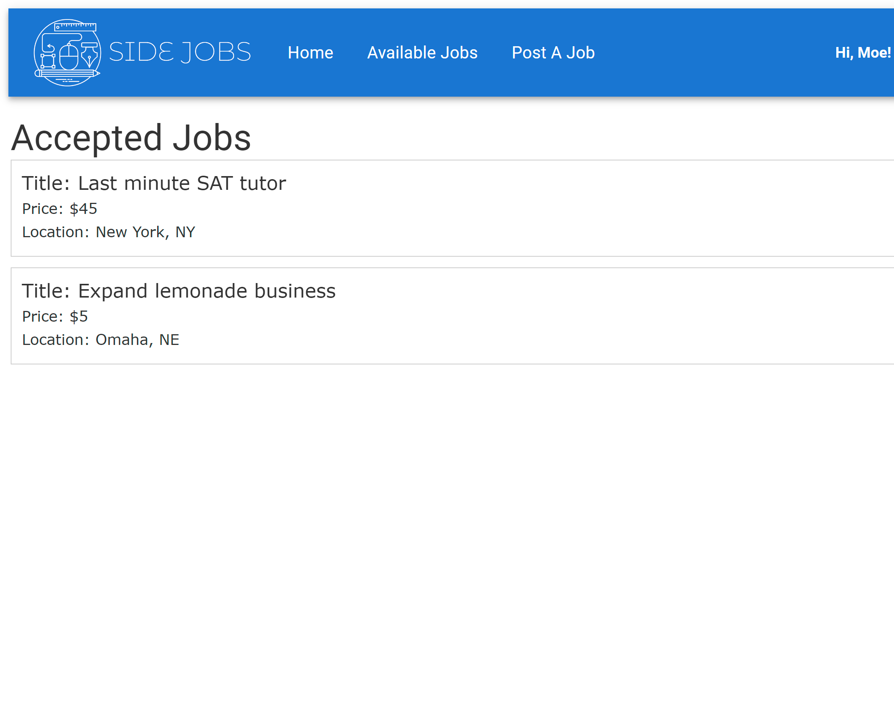 | 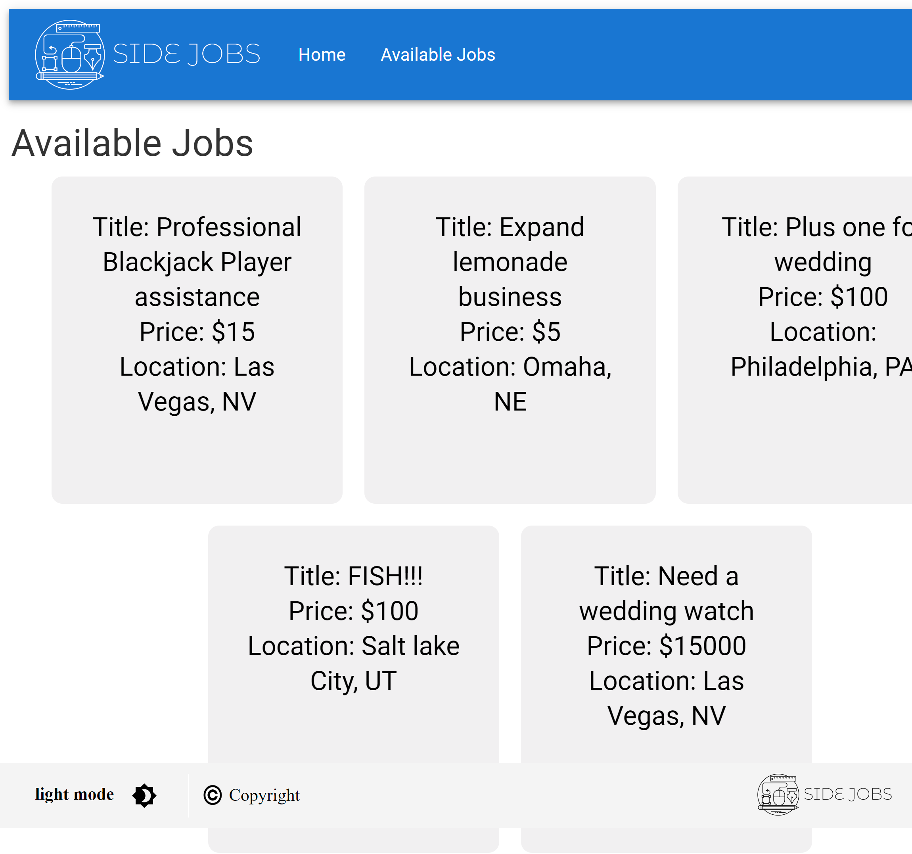 |

Google Maps JavaScript API is used to render the coordinates for the accurate map location using the react google maps npm library and data retrieved from the backend database.

|                  *Google Maps API 1*       |           *Google Maps API 2*              |
|:-----------------------:|:-----------------------:|
| 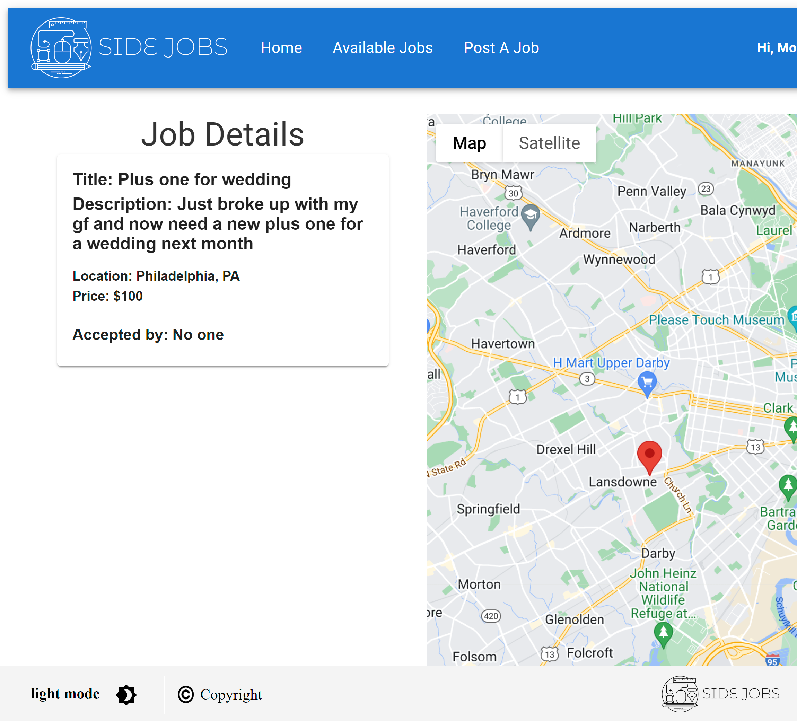 | 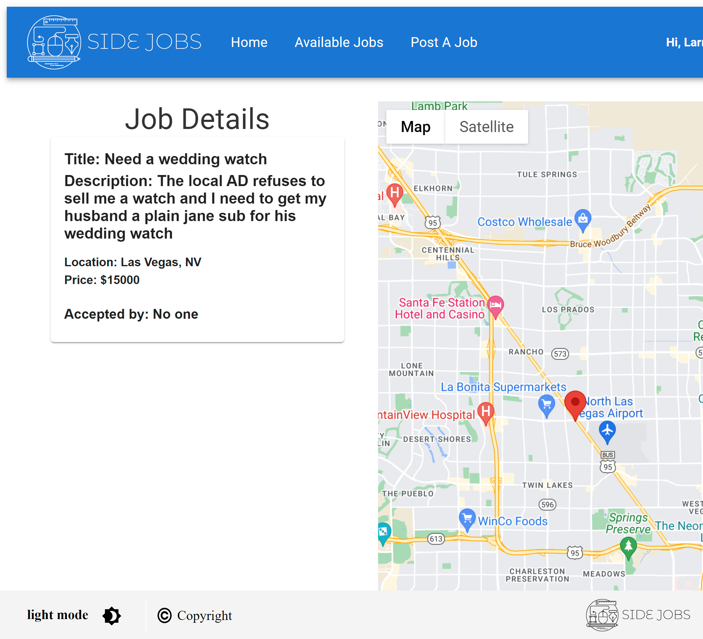 |

Once the user accepts an available job listing, the option for live chat between the creator and the jobseeker is available. I used websockets so that users can speak with each other in real-time.

|                  *live chat 1*       |           *live chat 2*              |
|:-----------------------:|:-----------------------:|
| 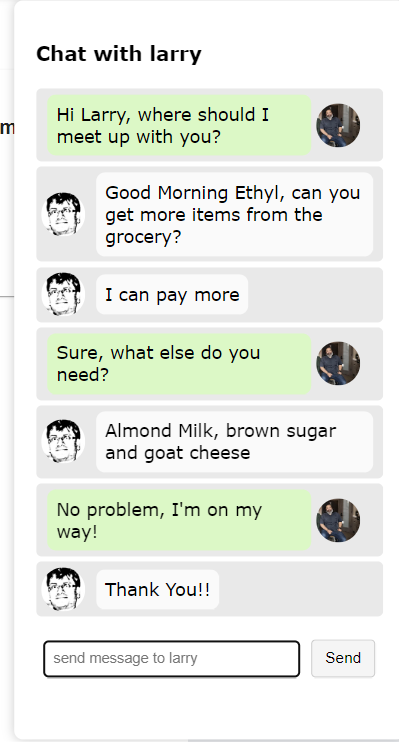 | 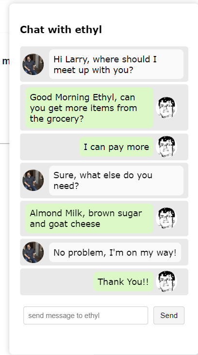 |

An app that requires users to interact with one another requires extensive social proofing, that is why components dedicated to peer reviews is necessary to establish trust.

|                  *review update*       |           *personal reviews*              |
|:-----------------------:|:-----------------------:|
| 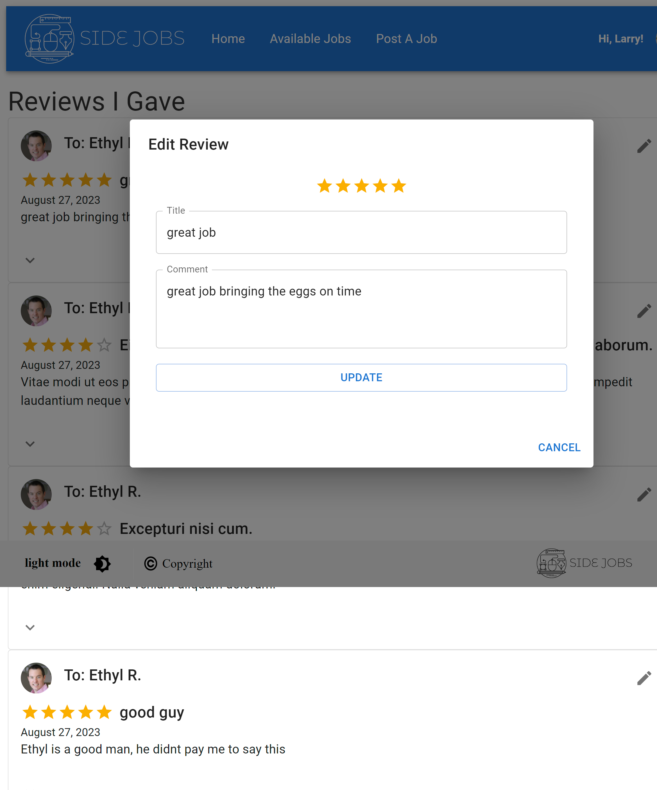 | 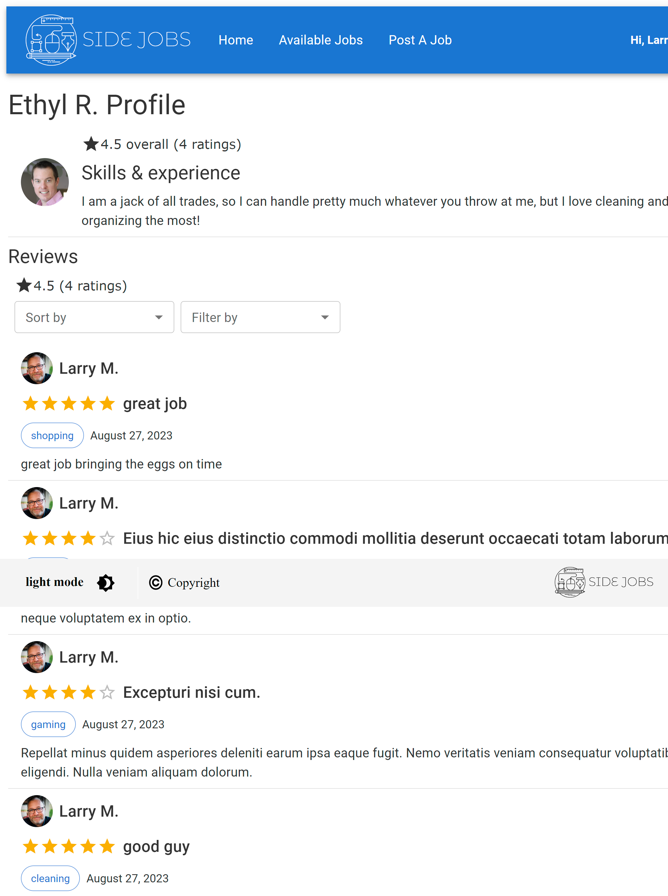 |

The profile of the users accounts is also where users can add funding to their accounts. Upon completion of their accepted jobs the user would have their account balance updated.

|                  *profile*       |
|:-----------------------:|
| 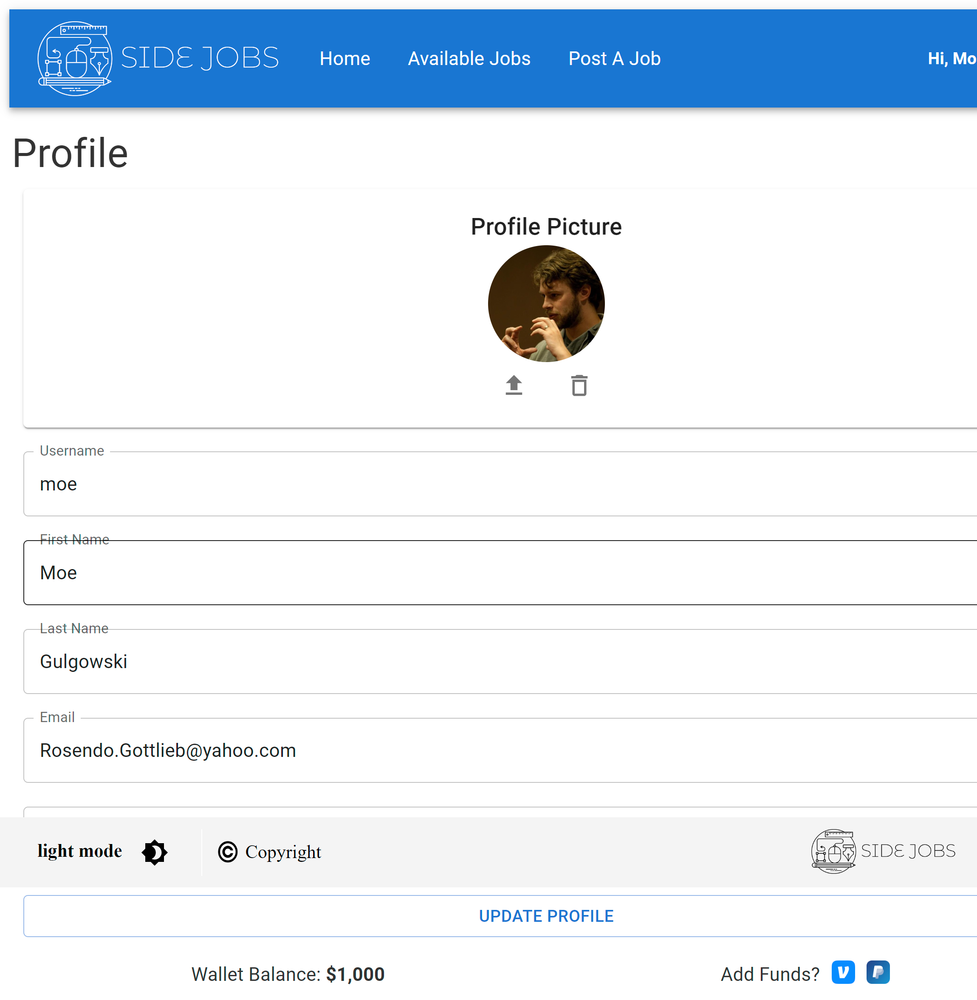 |

Using api endpoints that use CRUD processes, admins are able to ban and delete inappropriate tasks and repeat offenders.

|           *admin*              |
|:-----------------------:|
 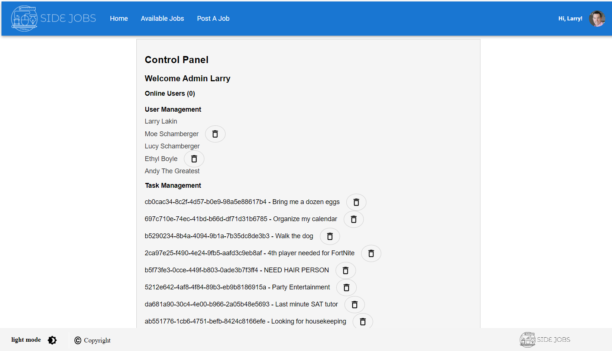 |